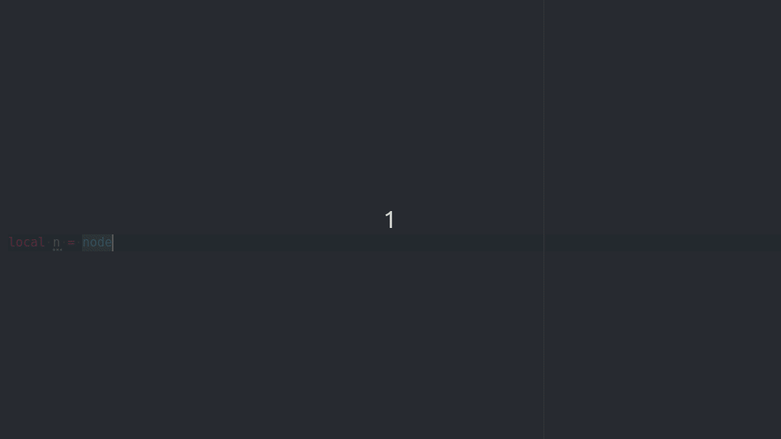
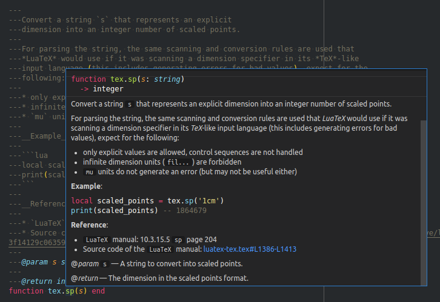
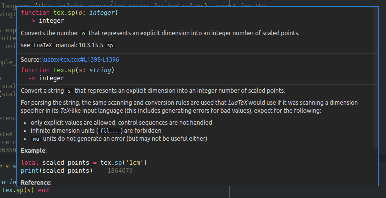
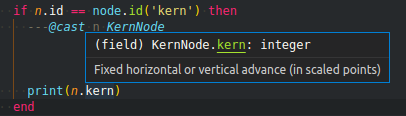
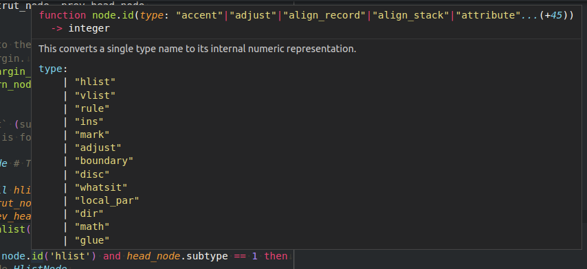

# LuaTeX Lua API

Type definitions for the Lua API of `LuaTeX` and related projects.



[LuaTeX](http://luatex.org) has a very large [Lua](https://www.lua.org)
API. This project tries to make this API accessible in the text editor
of your choice. This is made possible by the
[lua-language-server](https://github.com/LuaLS/lua-language-server) - a
server that implements the [Language Server Protocol
(LSP)](https://en.wikipedia.org/wiki/Language_Server_Protocol) for the
`Lua` language. Features such as code completion, syntax highlighting
and marking of warnings and errors, should therefore not only be
possible in [Visual Studio Code](https://code.visualstudio.com), but in
a [large number of
editors](https://langserver.org/#implementations-client) that support
the `LSP`.

## Related projects

* [Visual Studio Code LuaTeX Extension](https://github.com/Josef-Friedrich/vscode_LuaTeX_Lua-API)
  ← [library](https://github.com/Josef-Friedrich/LuaTeX_Lua-API/tree/main/library)

### Subprojects (upstream / pull) detached from this repository

* [LuaCats: lpeg](https://github.com/LuaCATS/lpeg)
  → [library/luatex/lpeg.lua](https://github.com/Josef-Friedrich/LuaTeX_Lua-API/blob/main/library/luatex/lpeg.lua)
* [LuaCats: luaharfbuzz](https://github.com/LuaCATS/luaharfbuzz)
  → [library/luatex/luaharfbuzz.lua](https://github.com/Josef-Friedrich/LuaTeX_Lua-API/blob/main/library/luatex/luaharfbuzz.lua)
* [LuaCats: luasocket](https://github.com/LuaCATS/luasocket)
  → [library/luatex/socket.lua](https://github.com/Josef-Friedrich/LuaTeX_Lua-API/blob/main/library/luatex/socket.lua)
  → [library/luatex/mime.lua](https://github.com/Josef-Friedrich/LuaTeX_Lua-API/blob/main/library/luatex/mime.lua)
* [LuaCats: luazip](https://github.com/LuaCATS/luazip)
  → [library/luatex/zip.lua](https://github.com/Josef-Friedrich/LuaTeX_Lua-API/blob/main/library/luatex/zip.lua)
* [LuaCats: lzlib](https://github.com/LuaCATS/lzlib)
  → [library/luatex/zlib.lua](https://github.com/Josef-Friedrich/LuaTeX_Lua-API/blob/main/library/luatex/zlib.lua)
* [LuaCats: md5](https://github.com/LuaCATS/md5)
  → [library/luatex/md5.lua](https://github.com/Josef-Friedrich/LuaTeX_Lua-API/blob/main/library/luatex/md5.lua)
* [LuaCats: slnunicode](https://github.com/LuaCATS/slnunicode)
  → [library/luatex/unicode.lua](https://github.com/Josef-Friedrich/LuaTeX_Lua-API/blob/main/library/luatex/unicode.lua)

### Subprojects (push) detached from this repository

* [LuaCats: tex-luatex](https://github.com/LuaCATS/tex-luatex)
  ← [library/luatex](https://github.com/Josef-Friedrich/LuaTeX_Lua-API/tree/main/library/luatex)
* [LuaCats: tex-lualatex](https://github.com/LuaCATS/tex-lualatex)
  ← [library/luatex](https://github.com/Josef-Friedrich/LuaTeX_Lua-API/tree/main/library/luatex)

## Directory structure of the repository

In the subfolder `library` are files named after the global libraries
they document. For example, the `library/tex.lua` file contains the
documentation for the `tex` library. These *Lua* files don’t contain
real *Lua* code. They consist only of function bodies and empty
tables. The main focus is in the docstrings.

The API documentation is written in a [well documented annotation
format](https://luals.github.io/wiki/annotations).
This format is based on the [EmmyLua](https://emmylua.github.io)
format. Unfortunately, the *Lua* community has not yet been able to
agree on a standarized annotation format. Many *Lua* project are
documented in the [LDoc](https://github.com/lunarmodules/LDoc) format.
However, the differences between these formats are marginal.

### Directory `library`

The actual definitions are located in the directory `library`. This
directory is divided into further subdirectories. In the folder `luatex`
you will find the definitions that the engine *LuaTeX* provides. The
folder `lualibs` documents the extension library of the same name. If
you use `lualatex`, you may be interested in the folder of the same
name.

### Directory `resources`

The folder `resources` contains *TeX* manuals and *HTML* online
documentation  converted into *Lua* docstrings.

### Directory `examples`

The `example` folder contains *TeX* and *Lua* files for demonstrating
and testing the documented Lua API.

## Version on CTAN

The type definitions are published on CTAN as a single file to avoid
cluttering the CTAN directory with many individual Lua files. Since this
one file is just under 1.5 MB in size, a configuration must be made so
that the language server can load the file. The following configuration
example sets the preload file size to a maximum of 5000 kB.

```json
{
    "Lua.workspace.preloadFileSize": 5000,
}
```

There are several ways to include type definitions in a project.
The easiest way is to copy the file into the project folder.
Or you can use the configuration `Lua.workspace.library`:

```json
{
    "Lua.workspace.library": ["/path/to/luatex-type-definitions.lua"]
}
```

## Current version

2025/07/13 v0.1.0

## License

Copyright (C) 2022-2025 by Josef Friedrich <josef@friedrich.rocks>
------------------------------------------------------------------------

This program is free software: you can redistribute it and/or modify it
under the terms of the GNU General Public License as published by the
Free Software Foundation, either version 2 of the License, or (at your
option) any later version.

This program is distributed in the hope that it will be useful, but
WITHOUT ANY WARRANTY; without even the implied warranty of
MERCHANTABILITY or FITNESS FOR A PARTICULAR PURPOSE. See the GNU General
Public License for more details.

You should have received a copy of the GNU General Public License along
with this program. If not, see <https://www.gnu.org/licenses/>.

## Installation / Setup for Visual Studio Code

Install [Visual Studio Code](https://code.visualstudio.com/) and the
[lua-language-server](https://marketplace.visualstudio.com/items?itemName=sumneko.lua).


```
git clone https://github.com/Josef-Friedrich/LuaTeX_Lua-API.git
```

`.vscode/settings.json`:

```json
{
"Lua.workspace.library": [
    "<repo>/library"
  ]
}
```

## How to contribute

The preferred method of contributing to the project is via Github pull
requests. You can also email patches to josef@friedrich.rocks.
It is ok if you only document the data types of the input parameters.

Use imperative mood for the first line: https://peps.python.org/pep-0257/

`Please contribute!` messages

Default message:

```lua
---😱 [Types](https://github.com/Josef-Friedrich/LuaTeX_Lua-API/blob/main/library/luatex/pdf.lua) incomplete or incorrect? 🙏 [Please contribute!](https://github.com/Josef-Friedrich/LuaTeX_Lua-API/pulls)
```

No documentation at all:

```lua
---
---Warning! Undocumented code!<p>
---TODO: Please contribute
---https://github.com/Josef-Friedrich/LuaTeX_Lua-API#how-to-contribute
```

### Minimal example of `tex.sp()`

```lua
---
---@param s string
function tex.sp(s) end
```

### Less minimal example of `tex.sp()`

```lua
---
---@param s string
---
---@return integer
function tex.sp(s) end
```

Or if you have more time you can also expand the documentation to this
level:

### Prime example of `tex.sp()`

```lua
---@meta

tex = {}

---
---Convert a string `s` that represents an explicit
---dimension into an integer number of scaled points.
---
---For parsing the string, the same scanning and conversion rules are used that
---*LuaTeX* would use if it was scanning a dimension specifier in its *TeX*-like
---input language (this includes generating errors for bad values), expect for the
---following:
---
---* only explicit values are allowed, control sequences are not handled
---* infinite dimension units (`fil...`) are forbidden
---* `mu` units do not generate an error (but may not be useful either)
---
---__Example:__
---
---```lua
---local scaled_points = tex.sp('1cm')
---print(scaled_points) -- 1864679
---```
---
---__Reference:__
---
---* `LuaTeX` manual: 10.3.15.5 `sp` page 204
---* Source code of the `LuaTeX` manual: [luatex-tex.tex#L1386-L1413](https://gitlab.lisn.upsaclay.fr/texlive/luatex/-/blob/f52b099f3e01d53dc03b315e1909245c3d5418d3/manual/luatex-tex.tex#L1386-L1413)
---
---@param s string # A string to convert into scaled points.
---
---@return integer # The dimension in the scaled points format.
function tex.sp(s) end
```

The docstring above is rendered as follows in Visual Studio Code:



The description text can be or was taken from the official [LuaTeX
reference manual](https://github.com/TeX-Live/luatex/tree/trunk/manual).
In the project folder
[resources/manuals/luatex](https://github.com/Josef-Friedrich/LuaTeX_Lua-API/tree/main/resources/manuals/luatex)
you will find slightly edited `Lua` versions of the `LuaTeX` manual
sources.

1.  [Preamble](https://github.com/Josef-Friedrich/LuaTeX_Lua-API/blob/main/resources/manuals/luatex/01_preamble.tex.lua)
2.  [Basic TEX enhancements](https://github.com/Josef-Friedrich/LuaTeX_Lua-API/blob/main/resources/manuals/luatex/02_enhancements.tex.lua)
3.  [Modifications](https://github.com/Josef-Friedrich/LuaTeX_Lua-API/blob/main/resources/manuals/luatex/03_modifications.tex.lua)
4.  [Using LUATEX](https://github.com/Josef-Friedrich/LuaTeX_Lua-API/blob/main/resources/manuals/luatex/04_lua.tex.lua)
5.  [Languages, characters, fonts and glyphs](https://github.com/Josef-Friedrich/LuaTeX_Lua-API/blob/main/resources/manuals/luatex/05_languages.tex.lua)
6.  [Font structure](https://github.com/Josef-Friedrich/LuaTeX_Lua-API/blob/main/resources/manuals/luatex/06_fonts.tex.lua)
7.  [Math](https://github.com/Josef-Friedrich/LuaTeX_Lua-API/blob/main/resources/manuals/luatex/07_math.tex.lua)
8.  [Nodes](https://github.com/Josef-Friedrich/LuaTeX_Lua-API/blob/main/resources/manuals/luatex/08_nodes.tex.lua)
9.  [LUA callbacks](https://github.com/Josef-Friedrich/LuaTeX_Lua-API/blob/main/resources/manuals/luatex/09_callbacks.tex.lua)
10. [The TEX related libraries](https://github.com/Josef-Friedrich/LuaTeX_Lua-API/blob/main/resources/manuals/luatex/10_tex.tex.lua)
11. [The graphic libraries](https://github.com/Josef-Friedrich/LuaTeX_Lua-API/blob/main/resources/manuals/luatex/11_graphics.tex.lua)
12. [The fontloader](https://github.com/Josef-Friedrich/LuaTeX_Lua-API/blob/main/resources/manuals/luatex/12_fontloader.tex.lua)
13. [The HarfBuzz libraries](https://github.com/Josef-Friedrich/LuaTeX_Lua-API/blob/main/resources/manuals/luatex/13_harfbuzz.tex.lua)
14. [The backend libraries](https://github.com/Josef-Friedrich/LuaTeX_Lua-API/blob/main/resources/manuals/luatex/14_backend.tex.lua)

This quick hacked and very ugly Python script
[resources/manuals/convert-tex-to-lua-docstrings.py](https://github.com/Josef-Friedrich/LuaTeX_Lua-API/blob/main/resources/manuals/convert-tex-to-lua-docstrings.py)
was used to convert the source files.

### Navigation table `_N`

Some Lua files contain a table named `_N`. `_N` stands for `navigation`.
With the help of this table and the outline view of the editor, it is
easier to navigate through the documentation. The name is inspired by
the global Lua table `_G`. Many parts of the documentation, such as the
definition of the various `Node` classes, are not shown in the outline.
If the API documentation is published, the `_N` table can be commented
out.

### Documentation of function overloading

`LuaTeX` makes extensive use of function overloading. The following
example is taken from the `LuaTeX` manual:

```
<number> w, <number> h, <number> d =
  node.dimensions(<node> n)
<number> w, <number> h, <number> d =
  node.dimensions(<node> n, <string> dir)
<number> w, <number> h, <number> d =
  node.dimensions(<node> n, <node> t)
<number> w, <number> h, <number> d =
  node.dimensions(<node> n, <node> t, <string> dir)
<number> w, <number> h, <number> d =
  node.dimensions(<number> glue_set, <number> glue_sign, <number> glue_order, <node> n)
<number> w, <number> h, <number> d =
  node.dimensions(<number> glue_set, <number> glue_sign, <number> glue_order, <node> n, <string> dir)
<number> w, <number> h, <number> d =
  node.dimensions(<number> glue_set, <number> glue_sign, <number> glue_order, <node> n, <node> t)
<number> w, <number> h, <number> d =
  node.dimensions(<number> glue_set, <number> glue_sign, <number> glue_order, <node> n, <node> t, <string> dir)
```

This can easily be done by documenting the function with the same name
but different signatures multiple times.

[Issue for further improvement of the function loading](https://github.com/sumneko/lua-language-server/issues/1456)

Function overloading in `tex.sp()`



### Documentation of nodes

A node (object) can be described by the `@class` annotation and provided
with some documentation about its attributes using `@field`. There is a base class `Node` for all node type classes.

```lua
---
---A node that comprise actual typesetting commands. A few fields are
---present in all nodes regardless of their type, these are:
---
---@class Node
---@field next Node|nil # the next node in a list, or nil
---@field prev Node|nil # That prev field is always present, but only initialized on explicit request ...
```

The `KernNode` class for example inherits from `Node` and represents
a kern node.

```lua
---
---The `kern` command creates such nodes but for instance the font and math
---machinery can also add them.
---
---@class KernNode: Node
---@field subtype KernNodeSubtype
---@field kern integer # Fixed horizontal or vertical advance (in scaled points)
```

```lua
---@alias KernNodeSubtype
---|0 # fontkern
---|1 # userkern
---|2 # accentkern
---|3 # italiccorrection
```

The `@cast` annotation forces a unspecific node to a distinct node type.

```lua
while n do
  if n.id == node.id('kern') then
    ---@cast n KernNode
    print(n.kern)
  end
  n = n.next
end
```

Use `--[[@as <node type>]]` to force a node type onto an expression.

```lua
local kern = node.new('kern') --[[@as KernNode]]
```




### Documentation of callback functions

How a callback function is documented is shown using the
`pre_linebreak_filter` as an example.

#### @alias `PreLinebreakFilterGroupCode`

```lua
---
---The string called `groupcode` identifies the nodelist's context within
---*TeX*'s processing. The range of possibilities is given in the table below, but
---not all of those can actually appear in `pre_linebreak_filter`, some are
---for the `hpack_filter` and `vpack_filter` callbacks that will be
---explained in the next two paragraphs.
---@alias PreLinebreakFilterGroupCode
---|'' # main vertical list
---|'hbox' # hbox` in horizontal mode
---|'adjusted_hbox' #hbox` in vertical mode
---|'vbox' # vbox`
---|'vtop' # vtop' #
---|'align' # halign` or `valign`
---|'disc' # discretionaries
---|'insert' # packaging an insert
---|'vcenter' # vcenter`
---|'local_box' # localleftbox` or `localrightbox`
---|'split_off' # top of a `vsplit`
---|'split_keep' # remainder of a `vsplit`
---|'align_set' # alignment cell
---|'fin_row' # alignment row
```

#### @alias `NodeCallbackReturn`


```lua
---
---As for all the callbacks that deal with nodes, the return value can be one of
---three things:
---
---* boolean `true` signals successful processing
---* `<node>` signals that the “head” node should be replaced by the
---  returned node
---* boolean `false` signals that the “head” node list should be
---  ignored and flushed from memory
---@alias NodeCallbackReturn true|false|Node
```

#### @alias `PreLinebreakFilter`

```lua
---
---# `pre_linebreak_filter` callback
---
---This callback is called just before *LuaTeX* starts converting a list of nodes
---into a stack of `hbox`es, after the addition of `parfillskip`.
---
---```lua
------@type PreLinebreakFilter
---function(head, groupcode)
---  --- true|false|node
---  return true
---end
---```
---
---This callback does not replace any internal code.
---@alias PreLinebreakFilter fun(head: Node, groupcode: PreLinebreakFilterGroupCode): NodeCallbackReturn
```

Annotation your custom callback function with `@type`.

```lua
---@type PreLinebreakFilter
local function visit_nodes(head, group)
  return true
end

luatexbase.add_to_callback('pre_linebreak_filter', visit_nodes, 'visit nodes')
```


Quick info `node.id(type)`



Type error in `node.id(type)`


`node.id(type)` type definition


Quick info `node.write(n)`


Documentation for the field `data` of the `pdf_colorstack` node:


## Documentation

* [LuaTeX Repo](https://gitlab.lisn.upsaclay.fr/texlive/luatex/) [LuaTeX Mirror](https://github.com/TeX-Live/luatex)
* [pdfTeX Mirror](https://github.com/tex-mirror/pdftex)

## Howtos

* [Custom libraries](https://github.com/sumneko/lua-language-server/wiki/Libraries#custom)
* [@meta annotation](https://github.com/sumneko/lua-language-server/wiki/Annotations#meta)

## Other type definition / stub repos:

* [Template of the Lua interface itself](https://github.com/sumneko/lua-language-server/tree/master/meta/template)
* [In the lua-language-server included 3rd party libraries](https://github.com/sumneko/lua-language-server/tree/master/meta/3rd)
* [FiveM Lua Stubs](https://github.com/jamie-34254/fivem_lua_stubs)


## References

```lua
---
---__Reference:__
---
---* Corresponding C source code: [ltexlib.c#L1430-L1436](https://gitlab.lisn.upsaclay.fr/texlive/luatex/-/blob/f52b099f3e01d53dc03b315e1909245c3d5418d3/source/texk/web2c/luatexdir/lua/ltexlib.c#L1430-L1436)
---* Source code of the `LuaTeX` manual: [luatex-nodes.tex#L1199-L1211](https://gitlab.lisn.upsaclay.fr/texlive/luatex/-/blob/f52b099f3e01d53dc03b315e1909245c3d5418d3/manual/luatex-nodes.tex#L1199-L1211)
---* Corresponding plain TeX control sequence: [\sfcode](https://www.tug.org/utilities/plain/cseq.html#sfcode-rp)
---* Victor Eijkhout. “TeX by Topic” (1991, 2007) [page 185](http://mirrors.ctan.org/info/texbytopic/TeXbyTopic.pdf)
---* Donald Ervin Knuth. “The TexBook” (1984): page 76. Also: 76, 271, 285, 363, 433. [TeX-Source](https://ctan.org/tex-archive/systems/knuth/dist/tex/texbook.tex) [PDF](https://visualmatheditor.equatheque.net/doc/texbook.pdf)
---David Bausum. “TeX Reference Manual” (2002) [](https://www.tug.org/utilities/plain/cseq.html)
```

```lua
---
---__Reference:__
---
---* Source code of the `LuaTeX` manual: []()
---
```

## Global namespace

The following listing is generated inside from `LuaTeX` using the small
script below.


### arg

- `arg.0` (string)
- `arg.1` (string)

### bit32

- __`bit32.arshift` (function)__
- __`bit32.band` (function)__
- __`bit32.bnot` (function)__
- __`bit32.bor` (function)__
- __`bit32.btest` (function)__
- __`bit32.bxor` (function)__
- __`bit32.extract` (function)__
- __`bit32.lrotate` (function)__
- __`bit32.lshift` (function)__
- __`bit32.replace` (function)__
- __`bit32.rrotate` (function)__
- __`bit32.rshift` (function)__

### callback

- __`callback.find` (function)__
- __`callback.list` (function)__
- __`callback.register` (function)__

### config

- *`config.actions` (table)*
- *`config.lualibs` (table)*
- *`config.luaotfload` (table)*

### dir

- __`dir.collectpattern` (function)__
- __`dir.current` (function)__
- __`dir.expandname` (function)__
- __`dir.found` (function)__
- __`dir.glob` (function)__
- __`dir.globdirs` (function)__
- __`dir.globfiles` (function)__
- __`dir.globpattern` (function)__
- __`dir.ls` (function)__
- __`dir.makedirs` (function)__
- __`dir.mkdirs` (function)__
- __`dir.pop` (function)__
- __`dir.push` (function)__

### file

- __`file.addsuffix` (function)__
- __`file.basename` (function)__
- __`file.checksum` (function)__
- __`file.collapse_path` (function)__
- __`file.collapsepath` (function)__
- __`file.copy` (function)__
- __`file.dirname` (function)__
- __`file.expandname` (function)__
- __`file.extname` (function)__
- __`file.is_qualified_path` (function)__
- __`file.is_readable` (function)__
- __`file.is_rootbased_path` (function)__
- __`file.is_writable` (function)__
- __`file.isreadable` (function)__
- __`file.iswritable` (function)__
- __`file.join` (function)__
- __`file.joinpath` (function)__
- __`file.loadchecksum` (function)__
- __`file.nameonly` (function)__
- __`file.nametotable` (function)__
- __`file.needs_updating` (function)__
- __`file.needsupdating` (function)__
- __`file.pathpart` (function)__
- __`file.readdata` (function)__
- __`file.removesuffix` (function)__
- __`file.replacesuffix` (function)__
- __`file.reslash` (function)__
- __`file.robustname` (function)__
- __`file.savechecksum` (function)__
- __`file.savedata` (function)__
- __`file.size` (function)__
- __`file.split_path` (function)__
- __`file.splitbase` (function)__
- __`file.splitname` (function)__
- __`file.splitpath` (function)__
- __`file.strip` (function)__
- __`file.suffix` (function)__
- __`file.suffixes` (function)__
- __`file.suffixesonly` (function)__
- __`file.suffixonly` (function)__
- __`file.syncmtimes` (function)__
- __`file.withinbase` (function)__

### fio

- __`fio.getposition` (function)__
- __`fio.read2dot14` (function)__
- __`fio.readbytes` (function)__
- __`fio.readbytetable` (function)__
- __`fio.readcardinal1` (function)__
- __`fio.readcardinal1le` (function)__
- __`fio.readcardinal2` (function)__
- __`fio.readcardinal2le` (function)__
- __`fio.readcardinal3` (function)__
- __`fio.readcardinal3le` (function)__
- __`fio.readcardinal4` (function)__
- __`fio.readcardinal4le` (function)__
- __`fio.readcardinaltable` (function)__
- __`fio.readfixed2` (function)__
- __`fio.readfixed4` (function)__
- __`fio.readinteger1` (function)__
- __`fio.readinteger1le` (function)__
- __`fio.readinteger2` (function)__
- __`fio.readinteger2le` (function)__
- __`fio.readinteger3` (function)__
- __`fio.readinteger3le` (function)__
- __`fio.readinteger4` (function)__
- __`fio.readinteger4le` (function)__
- __`fio.readintegertable` (function)__
- __`fio.readline` (function)__
- __`fio.setposition` (function)__
- __`fio.skipposition` (function)__

### font

- __`font.addcharacters` (function)__
- __`font.current` (function)__
- __`font.define` (function)__
- __`font.each` (function)__
- *`font.fonts` (table)*
- __`font.frozen` (function)__
- __`font.getcopy` (function)__
- __`font.getfont` (function)__
- __`font.getparameters` (function)__
- __`font.id` (function)__
- __`font.max` (function)__
- __`font.nextid` (function)__
- __`font.originaleach` (function)__
- __`font.read_tfm` (function)__
- __`font.read_vf` (function)__
- __`font.setexpansion` (function)__
- __`font.setfont` (function)__

### fontloader

- __`fontloader.apply_afmfile` (function)__
- __`fontloader.apply_featurefile` (function)__
- __`fontloader.close` (function)__
- __`fontloader.fields` (function)__
- __`fontloader.info` (function)__
- __`fontloader.open` (function)__
- __`fontloader.to_table` (function)__

### fonts

- *`fonts.analyzers` (table)*
- *`fonts.cid` (table)*
- *`fonts.constructors` (table)*
- *`fonts.definers` (table)*
- *`fonts.encodings` (table)*
- *`fonts.expansions` (table)*
- *`fonts.formats` (table)*
- *`fonts.handlers` (table)*
- *`fonts.hashes` (table)*
- *`fonts.helpers` (table)*
- *`fonts.loggers` (table)*
- *`fonts.mappings` (table)*
- *`fonts.names` (table)*
- *`fonts.privateoffsets` (table)*
- *`fonts.protrusions` (table)*
- *`fonts.readers` (table)*
- *`fonts.specifiers` (table)*
- *`fonts.tables` (table)*
- *`fonts.tracers` (table)*

### functions

- __`functions.dummy` (function)__

### gzip

- __`gzip.close` (function)__
- __`gzip.compress` (function)__
- __`gzip.compressed` (function)__
- __`gzip.decompress` (function)__
- __`gzip.lines` (function)__
- __`gzip.load` (function)__
- __`gzip.open` (function)__
- __`gzip.save` (function)__
- __`gzip.suffix` (function)__

### img

- __`img.boxes` (function)__
- __`img.copy` (function)__
- __`img.fields` (function)__
- __`img.immediatewrite` (function)__
- __`img.immediatewriteobject` (function)__
- __`img.keys` (function)__
- __`img.new` (function)__
- __`img.node` (function)__
- __`img.scan` (function)__
- __`img.types` (function)__
- __`img.write` (function)__

### kpse

- __`kpse.check_permission` (function)__
- __`kpse.default_texmfcnf` (function)__
- __`kpse.expand_braces` (function)__
- __`kpse.expand_path` (function)__
- __`kpse.expand_var` (function)__
- __`kpse.find_file` (function)__
- __`kpse.init_prog` (function)__
- __`kpse.lookup` (function)__
- __`kpse.new` (function)__
- __`kpse.readable_file` (function)__
- __`kpse.record_input_file` (function)__
- __`kpse.record_output_file` (function)__
- __`kpse.set_program_name` (function)__
- __`kpse.show_path` (function)__
- __`kpse.var_value` (function)__
- __`kpse.version` (function)__

### lang

- __`lang.clean` (function)__
- __`lang.clear_hyphenation` (function)__
- __`lang.clear_patterns` (function)__
- __`lang.gethjcode` (function)__
- __`lang.hyphenate` (function)__
- __`lang.hyphenation` (function)__
- __`lang.hyphenationmin` (function)__
- __`lang.id` (function)__
- __`lang.new` (function)__
- __`lang.patterns` (function)__
- __`lang.postexhyphenchar` (function)__
- __`lang.posthyphenchar` (function)__
- __`lang.preexhyphenchar` (function)__
- __`lang.prehyphenchar` (function)__
- __`lang.sethjcode` (function)__

### lfs

- `lfs._COPYRIGHT` (string)
- `lfs._DESCRIPTION` (string)
- `lfs._VERSION` (string)
- __`lfs.attributes` (function)__
- __`lfs.chdir` (function)__
- __`lfs.currentdir` (function)__
- __`lfs.dir` (function)__
- __`lfs.isdir` (function)__
- __`lfs.isfile` (function)__
- __`lfs.isfound` (function)__
- __`lfs.link` (function)__
- __`lfs.lock` (function)__
- __`lfs.lock_dir` (function)__
- __`lfs.mkdir` (function)__
- __`lfs.mkdirs` (function)__
- __`lfs.modification` (function)__
- __`lfs.readlink` (function)__
- __`lfs.rmdir` (function)__
- __`lfs.setmode` (function)__
- __`lfs.shortname` (function)__
- __`lfs.symlinkattributes` (function)__
- __`lfs.touch` (function)__
- __`lfs.unlock` (function)__

### logs

- __`logs.disable` (function)__
- __`logs.enable` (function)__
- `logs.name` (string)
- __`logs.newline` (function)__
- __`logs.reporter` (function)__

### lpeg

- __`lpeg.B` (function)__
- __`lpeg.C` (function)__
- __`lpeg.Carg` (function)__
- __`lpeg.Cb` (function)__
- __`lpeg.Cc` (function)__
- __`lpeg.Cf` (function)__
- __`lpeg.Cg` (function)__
- __`lpeg.Cmt` (function)__
- __`lpeg.Cp` (function)__
- __`lpeg.Cs` (function)__
- __`lpeg.Ct` (function)__
- __`lpeg.P` (function)__
- __`lpeg.R` (function)__
- __`lpeg.S` (function)__
- __`lpeg.UP` (function)__
- __`lpeg.UR` (function)__
- __`lpeg.US` (function)__
- __`lpeg.V` (function)__
- __`lpeg.afterprefix` (function)__
- __`lpeg.anywhere` (function)__
- __`lpeg.append` (function)__
- __`lpeg.balancer` (function)__
- __`lpeg.beforesuffix` (function)__
- __`lpeg.checkedsplit` (function)__
- __`lpeg.containsws` (function)__
- __`lpeg.counter` (function)__
- __`lpeg.endstripper` (function)__
- __`lpeg.finder` (function)__
- __`lpeg.firstofsplit` (function)__
- __`lpeg.frontstripper` (function)__
- __`lpeg.instringchecker` (function)__
- __`lpeg.is_lpeg` (function)__
- __`lpeg.keeper` (function)__
- __`lpeg.locale` (function)__
- __`lpeg.match` (function)__
- __`lpeg.oneof` (function)__
- *`lpeg.patterns` (table)*
- __`lpeg.pcode` (function)__
- __`lpeg.print` (function)__
- __`lpeg.ptree` (function)__
- __`lpeg.replacer` (function)__
- __`lpeg.secondofsplit` (function)__
- __`lpeg.setmaxstack` (function)__
- __`lpeg.setutfcasers` (function)__
- __`lpeg.split` (function)__
- __`lpeg.splitat` (function)__
- __`lpeg.splitter` (function)__
- *`lpeg.splitters` (table)*
- __`lpeg.stripper` (function)__
- __`lpeg.times` (function)__
- __`lpeg.tsplitat` (function)__
- __`lpeg.tsplitter` (function)__
- __`lpeg.type` (function)__
- __`lpeg.utfchartabletopattern` (function)__
- __`lpeg.utfreplacer` (function)__
- __`lpeg.version` (function)__

### ltn12

- `ltn12.BLOCKSIZE` (number)
- *`ltn12._M` (table)*
- `ltn12._NAME` (string)
- `ltn12._PACKAGE` (string)
- `ltn12._VERSION` (string)
- *`ltn12.filter` (table)*
- *`ltn12.pump` (table)*
- *`ltn12.sink` (table)*
- *`ltn12.source` (table)*

### ltx

- *`ltx.utils` (table)*

### lua

- *`lua.bytecode` (table)*
- __`lua.get_functions_table` (function)__
- __`lua.getbytecode` (function)__
- __`lua.getcalllevel` (function)__
- __`lua.getcodepage` (function)__
- __`lua.getluaname` (function)__
- __`lua.getstacktop` (function)__
- *`lua.name` (table)*
- __`lua.newtable` (function)__
- __`lua.setbytecode` (function)__
- __`lua.setluaname` (function)__
- `lua.version` (string)

### luaharfbuzz

- *`luaharfbuzz.Blob` (table)*
- *`luaharfbuzz.Buffer` (table)*
- *`luaharfbuzz.Direction` (table)*
- *`luaharfbuzz.Face` (table)*
- *`luaharfbuzz.Feature` (table)*
- *`luaharfbuzz.Font` (table)*
- *`luaharfbuzz.Language` (table)*
- *`luaharfbuzz.Script` (table)*
- *`luaharfbuzz.Tag` (table)*
- *`luaharfbuzz.Variation` (table)*
- *`luaharfbuzz.ot` (table)*
- __`luaharfbuzz.shape_full` (function)__
- __`luaharfbuzz.shapers` (function)__
- *`luaharfbuzz.unicode` (table)*
- __`luaharfbuzz.version` (function)__

### lualibs

- `lualibs.basic_loaded` (boolean)
- `lualibs.extended_loaded` (boolean)
- __`lualibs.info` (function)__
- `lualibs.load_extended` (boolean)
- __`lualibs.loadmodule` (function)__
- *`lualibs.module_info` (table)*
- `lualibs.prefer_merged` (boolean)
- __`lualibs.warn` (function)__

### luaotfload

- __`luaotfload.add_colorscheme` (function)__
- __`luaotfload.add_fallback` (function)__
- __`luaotfload.add_multiscript` (function)__
- __`luaotfload.apply_default_features` (function)__
- *`luaotfload.aux` (table)*
- *`luaotfload.default_config` (table)*
- __`luaotfload.define_font` (function)__
- *`luaotfload.features` (table)*
- *`luaotfload.fontloader` (table)*
- `luaotfload.fontloader_package` (string)
- __`luaotfload.get_script_mark` (function)__
- *`luaotfload.harf` (table)*
- *`luaotfload.harfbuzz` (table)*
- *`luaotfload.letterspace` (table)*
- *`luaotfload.loaders` (table)*
- *`luaotfload.log` (table)*
- __`luaotfload.main` (function)__
- *`luaotfload.parsers` (table)*
- *`luaotfload.resolvers` (table)*
- __`luaotfload.set_colorhandler` (function)__
- __`luaotfload.set_transparent_colorstack` (function)__
- __`luaotfload.set_transparenthandler` (function)__
- `luaotfload.version` (string)

### luatexbase

- __`luatexbase.add_to_callback` (function)__
- *`luatexbase.attributes` (table)*
- __`luatexbase.call_callback` (function)__
- __`luatexbase.callback_descriptions` (function)__
- *`luatexbase.callbacktypes` (table)*
- __`luatexbase.create_callback` (function)__
- __`luatexbase.declare_callback_rule` (function)__
- __`luatexbase.disable_callback` (function)__
- __`luatexbase.in_callback` (function)__
- __`luatexbase.module_error` (function)__
- __`luatexbase.module_info` (function)__
- __`luatexbase.module_warning` (function)__
- __`luatexbase.new_attribute` (function)__
- __`luatexbase.new_bytecode` (function)__
- __`luatexbase.new_chunkname` (function)__
- __`luatexbase.new_luafunction` (function)__
- __`luatexbase.new_whatsit` (function)__
- __`luatexbase.provides_module` (function)__
- __`luatexbase.registernumber` (function)__
- __`luatexbase.remove_from_callback` (function)__
- __`luatexbase.uninstall` (function)__

### mbox

- __`mbox.parse` (function)__
- __`mbox.parse_from` (function)__
- __`mbox.parse_header` (function)__
- __`mbox.parse_headers` (function)__
- __`mbox.parse_message` (function)__
- __`mbox.split_headers` (function)__
- __`mbox.split_mbox` (function)__
- __`mbox.split_message` (function)__

### md5

- __`md5.HEX` (function)__
- __`md5.crypt` (function)__
- __`md5.dec` (function)__
- __`md5.decrypt` (function)__
- __`md5.exor` (function)__
- __`md5.hex` (function)__
- __`md5.sum` (function)__
- __`md5.sumHEXA` (function)__
- __`md5.sumhexa` (function)__

### mime

- `mime._VERSION` (string)
- __`mime.b64` (function)__
- __`mime.decode` (function)__
- *`mime.decodet` (table)*
- __`mime.dot` (function)__
- __`mime.encode` (function)__
- *`mime.encodet` (table)*
- __`mime.eol` (function)__
- __`mime.normalize` (function)__
- __`mime.qp` (function)__
- __`mime.qpwrp` (function)__
- __`mime.stuff` (function)__
- __`mime.unb64` (function)__
- __`mime.unqp` (function)__
- __`mime.wrap` (function)__
- *`mime.wrapt` (table)*
- __`mime.wrp` (function)__

### modules

- *`modules.data-con` (table)*
- *`modules.font-afk` (table)*
- *`modules.font-cff` (table)*
- *`modules.font-cid` (table)*
- *`modules.font-con` (table)*
- *`modules.font-def` (table)*
- *`modules.font-dsp` (table)*
- *`modules.font-imp-effects` (table)*
- *`modules.font-imp-italics` (table)*
- *`modules.font-imp-ligatures` (table)*
- *`modules.font-imp-tex` (table)*
- *`modules.font-ini` (table)*
- *`modules.font-lua` (table)*
- *`modules.font-map` (table)*
- *`modules.font-ocl` (table)*
- *`modules.font-one` (table)*
- *`modules.font-onr` (table)*
- *`modules.font-osd` (table)*
- *`modules.font-ota` (table)*
- *`modules.font-otc` (table)*
- *`modules.font-oti` (table)*
- *`modules.font-otj` (table)*
- *`modules.font-otl` (table)*
- *`modules.font-oto` (table)*
- *`modules.font-otr` (table)*
- *`modules.font-ots` (table)*
- *`modules.font-ott` (table)*
- *`modules.font-oup` (table)*
- *`modules.font-shp` (table)*
- *`modules.font-ttf` (table)*
- *`modules.font-vfc` (table)*
- *`modules.l-boolean` (table)*
- *`modules.l-dir` (table)*
- *`modules.l-file` (table)*
- *`modules.l-functions` (table)*
- *`modules.l-io` (table)*
- *`modules.l-lpeg` (table)*
- *`modules.l-lua` (table)*
- *`modules.l-math` (table)*
- *`modules.l-md5` (table)*
- *`modules.l-number` (table)*
- *`modules.l-os` (table)*
- *`modules.l-package` (table)*
- *`modules.l-set` (table)*
- *`modules.l-string` (table)*
- *`modules.l-table` (table)*
- *`modules.l-unicode` (table)*
- *`modules.l-url` (table)*
- *`modules.luat-basics-gen` (table)*
- *`modules.luatex-font-enc` (table)*
- *`modules.luatex-font-mis` (table)*
- *`modules.luatex-fonts-def` (table)*
- *`modules.luatex-fonts-ext` (table)*
- *`modules.luatex-fonts-gbn` (table)*
- *`modules.luatex-fonts-nod` (table)*
- *`modules.luatex-fonts-tfm` (table)*
- *`modules.trac-inf` (table)*
- *`modules.util-deb` (table)*
- *`modules.util-dim` (table)*
- *`modules.util-fil` (table)*
- *`modules.util-jsn` (table)*
- *`modules.util-lua` (table)*
- *`modules.util-prs` (table)*
- *`modules.util-sac` (table)*
- *`modules.util-sta` (table)*
- *`modules.util-sto` (table)*
- *`modules.util-str` (table)*
- *`modules.util-tab` (table)*
- *`modules.util-tpl` (table)*
- *`modules.util-zip` (table)*

### mplib

- __`mplib.char_depth` (function)__
- __`mplib.char_height` (function)__
- __`mplib.char_width` (function)__
- __`mplib.execute` (function)__
- __`mplib.fields` (function)__
- __`mplib.finish` (function)__
- __`mplib.get_boolean` (function)__
- __`mplib.get_number` (function)__
- __`mplib.get_numeric` (function)__
- __`mplib.get_path` (function)__
- __`mplib.get_string` (function)__
- __`mplib.new` (function)__
- __`mplib.pen_info` (function)__
- __`mplib.solve_path` (function)__
- __`mplib.statistics` (function)__
- __`mplib.version` (function)__

### node

- __`node.check_discretionaries` (function)__
- __`node.check_discretionary` (function)__
- __`node.copy` (function)__
- __`node.copy_list` (function)__
- __`node.count` (function)__
- __`node.current_attr` (function)__
- __`node.dimensions` (function)__
- *`node.direct` (table)*
- __`node.effective_glue` (function)__
- __`node.end_of_math` (function)__
- __`node.family_font` (function)__
- __`node.fields` (function)__
- __`node.find_attribute` (function)__
- __`node.first_glyph` (function)__
- __`node.fix_node_lists` (function)__
- __`node.flatten_discretionaries` (function)__
- __`node.flush_list` (function)__
- __`node.flush_node` (function)__
- __`node.flush_properties_table` (function)__
- __`node.free` (function)__
- __`node.get_attribute` (function)__
- __`node.get_properties_table` (function)__
- __`node.getboth` (function)__
- __`node.getchar` (function)__
- __`node.getdisc` (function)__
- __`node.getfield` (function)__
- __`node.getfont` (function)__
- __`node.getglue` (function)__
- __`node.getid` (function)__
- __`node.getleader` (function)__
- __`node.getlist` (function)__
- __`node.getnext` (function)__
- __`node.getprev` (function)__
- __`node.getproperty` (function)__
- __`node.getsubtype` (function)__
- __`node.getwhd` (function)__
- __`node.has_attribute` (function)__
- __`node.has_field` (function)__
- __`node.has_glyph` (function)__
- __`node.hpack` (function)__
- __`node.hyphenating` (function)__
- __`node.id` (function)__
- __`node.insert_after` (function)__
- __`node.insert_before` (function)__
- __`node.is_char` (function)__
- __`node.is_glyph` (function)__
- __`node.is_node` (function)__
- __`node.is_zero_glue` (function)__
- __`node.kerning` (function)__
- __`node.last_node` (function)__
- __`node.length` (function)__
- __`node.ligaturing` (function)__
- __`node.make_extensible` (function)__
- __`node.mlist_to_hlist` (function)__
- __`node.new` (function)__
- __`node.next` (function)__
- __`node.prepend_prevdepth` (function)__
- __`node.prev` (function)__
- __`node.protect_glyph` (function)__
- __`node.protect_glyphs` (function)__
- __`node.protrusion_skippable` (function)__
- __`node.rangedimensions` (function)__
- __`node.remove` (function)__
- __`node.set_attribute` (function)__
- __`node.set_properties_mode` (function)__
- __`node.setfield` (function)__
- __`node.setglue` (function)__
- __`node.setproperty` (function)__
- __`node.slide` (function)__
- __`node.subtype` (function)__
- __`node.subtypes` (function)__
- __`node.tail` (function)__
- __`node.tostring` (function)__
- __`node.traverse` (function)__
- __`node.traverse_char` (function)__
- __`node.traverse_glyph` (function)__
- __`node.traverse_id` (function)__
- __`node.traverse_list` (function)__
- __`node.type` (function)__
- __`node.types` (function)__
- __`node.unprotect_glyph` (function)__
- __`node.unprotect_glyphs` (function)__
- __`node.unset_attribute` (function)__
- __`node.usedlist` (function)__
- __`node.uses_font` (function)__
- __`node.values` (function)__
- __`node.vpack` (function)__
- __`node.whatsits` (function)__
- __`node.write` (function)__

### nodes

- *`nodes.dirvalues` (table)*
- *`nodes.disccodes` (table)*
- *`nodes.glyphcodes` (table)*
- *`nodes.handlers` (table)*
- *`nodes.injections` (table)*
- *`nodes.nodecodes` (table)*
- *`nodes.nuts` (table)*
- *`nodes.properties` (table)*
- __`nodes.simple_font_handler` (function)__
- __`nodes.tonode` (function)__
- __`nodes.tonut` (function)__

### pdf

- __`pdf.fontname` (function)__
- __`pdf.fontobjnum` (function)__
- __`pdf.fontsize` (function)__
- __`pdf.getcatalog` (function)__
- __`pdf.getcompresslevel` (function)__
- __`pdf.getcreationdate` (function)__
- __`pdf.getdecimaldigits` (function)__
- __`pdf.getdestmargin` (function)__
- __`pdf.getfontname` (function)__
- __`pdf.getfontobjnum` (function)__
- __`pdf.getfontsize` (function)__
- __`pdf.getgentounicode` (function)__
- __`pdf.gethpos` (function)__
- __`pdf.getignoreunknownimages` (function)__
- __`pdf.getimageresolution` (function)__
- __`pdf.getinclusionerrorlevel` (function)__
- __`pdf.getinfo` (function)__
- __`pdf.getlastannot` (function)__
- __`pdf.getlastlink` (function)__
- __`pdf.getlastobj` (function)__
- __`pdf.getlinkmargin` (function)__
- __`pdf.getmajorversion` (function)__
- __`pdf.getmatrix` (function)__
- __`pdf.getmaxobjnum` (function)__
- __`pdf.getminorversion` (function)__
- __`pdf.getnames` (function)__
- __`pdf.getnofobjects` (function)__
- __`pdf.getobjcompresslevel` (function)__
- __`pdf.getobjtype` (function)__
- __`pdf.getomitcharset` (function)__
- __`pdf.getomitcidset` (function)__
- __`pdf.getorigin` (function)__
- __`pdf.getpageattributes` (function)__
- __`pdf.getpageref` (function)__
- __`pdf.getpageresources` (function)__
- __`pdf.getpagesattributes` (function)__
- __`pdf.getpkresolution` (function)__
- __`pdf.getpos` (function)__
- __`pdf.getrecompress` (function)__
- __`pdf.getretval` (function)__
- __`pdf.getsuppressoptionalinfo` (function)__
- __`pdf.getthreadmargin` (function)__
- __`pdf.gettrailer` (function)__
- __`pdf.gettrailerid` (function)__
- __`pdf.getvpos` (function)__
- __`pdf.getxformattributes` (function)__
- __`pdf.getxformmargin` (function)__
- __`pdf.getxformname` (function)__
- __`pdf.getxformresources` (function)__
- __`pdf.hasmatrix` (function)__
- __`pdf.immediateobj` (function)__
- __`pdf.includechar` (function)__
- __`pdf.includefont` (function)__
- __`pdf.includeimage` (function)__
- __`pdf.mapfile` (function)__
- __`pdf.mapline` (function)__
- __`pdf.maxobjnum` (function)__
- __`pdf.newcolorstack` (function)__
- __`pdf.obj` (function)__
- __`pdf.objtype` (function)__
- __`pdf.pageref` (function)__
- __`pdf.print` (function)__
- __`pdf.refobj` (function)__
- __`pdf.registerannot` (function)__
- __`pdf.reserveobj` (function)__
- __`pdf.setcatalog` (function)__
- __`pdf.setcompresslevel` (function)__
- __`pdf.setdecimaldigits` (function)__
- __`pdf.setdestmargin` (function)__
- __`pdf.setfontattributes` (function)__
- __`pdf.setforcefile` (function)__
- __`pdf.setgentounicode` (function)__
- __`pdf.setignoreunknownimages` (function)__
- __`pdf.setimageresolution` (function)__
- __`pdf.setinclusionerrorlevel` (function)__
- __`pdf.setinfo` (function)__
- __`pdf.setlinkmargin` (function)__
- __`pdf.setmajorversion` (function)__
- __`pdf.setminorversion` (function)__
- __`pdf.setnames` (function)__
- __`pdf.setobjcompresslevel` (function)__
- __`pdf.setomitcharset` (function)__
- __`pdf.setomitcidset` (function)__
- __`pdf.setorigin` (function)__
- __`pdf.setpageattributes` (function)__
- __`pdf.setpageresources` (function)__
- __`pdf.setpagesattributes` (function)__
- __`pdf.setpkresolution` (function)__
- __`pdf.setrecompress` (function)__
- __`pdf.setsuppressoptionalinfo` (function)__
- __`pdf.setthreadmargin` (function)__
- __`pdf.settrailer` (function)__
- __`pdf.settrailerid` (function)__
- __`pdf.settypeonewidemode` (function)__
- __`pdf.setxformattributes` (function)__
- __`pdf.setxformmargin` (function)__
- __`pdf.setxformresources` (function)__
- __`pdf.xformname` (function)__

### pdfe

- __`pdfe.arraytotable` (function)__
- __`pdfe.close` (function)__
- __`pdfe.closestream` (function)__
- __`pdfe.dictionarytotable` (function)__
- __`pdfe.getarray` (function)__
- __`pdfe.getboolean` (function)__
- __`pdfe.getbox` (function)__
- __`pdfe.getcatalog` (function)__
- __`pdfe.getdictionary` (function)__
- __`pdfe.getfromarray` (function)__
- __`pdfe.getfromdictionary` (function)__
- __`pdfe.getfromreference` (function)__
- __`pdfe.getfromstream` (function)__
- __`pdfe.getinfo` (function)__
- __`pdfe.getinteger` (function)__
- __`pdfe.getmemoryusage` (function)__
- __`pdfe.getname` (function)__
- __`pdfe.getnofobjects` (function)__
- __`pdfe.getnofpages` (function)__
- __`pdfe.getnumber` (function)__
- __`pdfe.getpage` (function)__
- __`pdfe.getpages` (function)__
- __`pdfe.getsize` (function)__
- __`pdfe.getstatus` (function)__
- __`pdfe.getstream` (function)__
- __`pdfe.getstring` (function)__
- __`pdfe.gettrailer` (function)__
- __`pdfe.getversion` (function)__
- __`pdfe.new` (function)__
- __`pdfe.open` (function)__
- __`pdfe.openstream` (function)__
- __`pdfe.pagestotable` (function)__
- __`pdfe.readfromstream` (function)__
- __`pdfe.readwholestream` (function)__
- __`pdfe.type` (function)__
- __`pdfe.unencrypt` (function)__

### pdfscanner

- __`pdfscanner.scan` (function)__

### set

- __`set.contains` (function)__
- __`set.create` (function)__
- __`set.tolist` (function)__
- __`set.tonumber` (function)__
- __`set.totable` (function)__

### sha2

- __`sha2.digest256` (function)__
- __`sha2.digest384` (function)__
- __`sha2.digest512` (function)__

### sio

- __`sio.read2dot14` (function)__
- __`sio.readbytes` (function)__
- __`sio.readbytetable` (function)__
- __`sio.readcardinal1` (function)__
- __`sio.readcardinal1le` (function)__
- __`sio.readcardinal2` (function)__
- __`sio.readcardinal2le` (function)__
- __`sio.readcardinal3` (function)__
- __`sio.readcardinal3le` (function)__
- __`sio.readcardinal4` (function)__
- __`sio.readcardinal4le` (function)__
- __`sio.readcardinaltable` (function)__
- __`sio.readfixed2` (function)__
- __`sio.readfixed4` (function)__
- __`sio.readinteger1` (function)__
- __`sio.readinteger1le` (function)__
- __`sio.readinteger2` (function)__
- __`sio.readinteger2le` (function)__
- __`sio.readinteger3` (function)__
- __`sio.readinteger3le` (function)__
- __`sio.readinteger4` (function)__
- __`sio.readinteger4le` (function)__
- __`sio.readintegertable` (function)__

### socket

- `socket.BLOCKSIZE` (number)
- `socket._DATAGRAMSIZE` (number)
- `socket._DEBUG` (boolean)
- `socket._SETSIZE` (number)
- `socket._SOCKETINVALID` (number)
- `socket._VERSION` (string)
- __`socket.__unload` (function)__
- __`socket.bind` (function)__
- __`socket.choose` (function)__
- __`socket.connect` (function)__
- __`socket.connect4` (function)__
- __`socket.connect6` (function)__
- *`socket.dns` (table)*
- *`socket.ftp` (table)*
- __`socket.gettime` (function)__
- *`socket.headers` (table)*
- *`socket.http` (table)*
- __`socket.newtry` (function)__
- __`socket.protect` (function)__
- __`socket.select` (function)__
- __`socket.sink` (function)__
- *`socket.sinkt` (table)*
- __`socket.skip` (function)__
- __`socket.sleep` (function)__
- *`socket.smtp` (table)*
- __`socket.source` (function)__
- *`socket.sourcet` (table)*
- __`socket.tcp` (function)__
- __`socket.tcp4` (function)__
- __`socket.tcp6` (function)__
- *`socket.tp` (table)*
- __`socket.try` (function)__
- __`socket.udp` (function)__
- __`socket.udp4` (function)__
- __`socket.udp6` (function)__
- *`socket.url` (table)*

### statistics

- __`statistics.benchmarktimer` (function)__
- __`statistics.currenttime` (function)__
- __`statistics.elapsed` (function)__
- __`statistics.elapsedindeed` (function)__
- __`statistics.elapsedseconds` (function)__
- __`statistics.elapsedtime` (function)__
- `statistics.enable` (boolean)
- __`statistics.formatruntime` (function)__
- __`statistics.hastiming` (function)__
- __`statistics.memused` (function)__
- __`statistics.register` (function)__
- __`statistics.resettiming` (function)__
- __`statistics.runtime` (function)__
- __`statistics.show` (function)__
- __`statistics.starttiming` (function)__
- __`statistics.stoptiming` (function)__
- `statistics.threshold` (number)
- __`statistics.timed` (function)__
- __`statistics.tracefunction` (function)__

### status

- __`status.list` (function)__
- __`status.resetmessages` (function)__
- __`status.setexitcode` (function)__

### tex

- *`tex.attribute` (table)*
- __`tex.badness` (function)__
- *`tex.box` (table)*
- *`tex.catcode` (table)*
- *`tex.count` (table)*
- __`tex.cprint` (function)__
- __`tex.definefont` (function)__
- *`tex.delcode` (table)*
- *`tex.dimen` (table)*
- __`tex.enableprimitives` (function)__
- __`tex.error` (function)__
- __`tex.extraprimitives` (function)__
- __`tex.finish` (function)__
- __`tex.fontidentifier` (function)__
- __`tex.fontname` (function)__
- __`tex.force_synctex_line` (function)__
- __`tex.force_synctex_tag` (function)__
- __`tex.forcehmode` (function)__
- __`tex.get` (function)__
- __`tex.get_synctex_line` (function)__
- __`tex.get_synctex_mode` (function)__
- __`tex.get_synctex_tag` (function)__
- __`tex.getattribute` (function)__
- __`tex.getbox` (function)__
- __`tex.getboxresourcebox` (function)__
- __`tex.getboxresourcedimensions` (function)__
- __`tex.getcatcode` (function)__
- __`tex.getcount` (function)__
- __`tex.getdelcode` (function)__
- __`tex.getdelcodes` (function)__
- __`tex.getdimen` (function)__
- __`tex.getfontoffamily` (function)__
- __`tex.getglue` (function)__
- __`tex.getlccode` (function)__
- __`tex.getlist` (function)__
- __`tex.getlocallevel` (function)__
- __`tex.getmark` (function)__
- __`tex.getmath` (function)__
- __`tex.getmathcode` (function)__
- __`tex.getmathcodes` (function)__
- __`tex.getmodevalues` (function)__
- __`tex.getmuglue` (function)__
- __`tex.getmuskip` (function)__
- __`tex.getnest` (function)__
- __`tex.getpagestate` (function)__
- __`tex.getsfcode` (function)__
- __`tex.getskip` (function)__
- __`tex.gettoks` (function)__
- __`tex.getuccode` (function)__
- *`tex.glue` (table)*
- __`tex.hashtokens` (function)__
- __`tex.init_rand` (function)__
- __`tex.isattribute` (function)__
- __`tex.isbox` (function)__
- __`tex.iscount` (function)__
- __`tex.isdimen` (function)__
- __`tex.isglue` (function)__
- __`tex.ismuglue` (function)__
- __`tex.ismuskip` (function)__
- __`tex.isskip` (function)__
- __`tex.istoks` (function)__
- *`tex.lccode` (table)*
- __`tex.linebreak` (function)__
- *`tex.lists` (table)*
- __`tex.lua_math_random` (function)__
- __`tex.lua_math_randomseed` (function)__
- *`tex.mathcode` (table)*
- *`tex.muglue` (table)*
- *`tex.muskip` (table)*
- *`tex.nest` (table)*
- __`tex.normal_rand` (function)__
- __`tex.number` (function)__
- __`tex.primitives` (function)__
- __`tex.print` (function)__
- __`tex.quittoks` (function)__
- __`tex.resetparagraph` (function)__
- __`tex.romannumeral` (function)__
- __`tex.round` (function)__
- __`tex.run` (function)__
- __`tex.runtoks` (function)__
- __`tex.saveboxresource` (function)__
- __`tex.scale` (function)__
- __`tex.scantoks` (function)__
- __`tex.set` (function)__
- __`tex.set_synctex_line` (function)__
- __`tex.set_synctex_mode` (function)__
- __`tex.set_synctex_no_files` (function)__
- __`tex.set_synctex_tag` (function)__
- __`tex.setattribute` (function)__
- __`tex.setbox` (function)__
- __`tex.setcatcode` (function)__
- __`tex.setcount` (function)__
- __`tex.setdelcode` (function)__
- __`tex.setdimen` (function)__
- __`tex.setglue` (function)__
- __`tex.setlccode` (function)__
- __`tex.setlist` (function)__
- __`tex.setmath` (function)__
- __`tex.setmathcode` (function)__
- __`tex.setmuglue` (function)__
- __`tex.setmuskip` (function)__
- __`tex.setnest` (function)__
- __`tex.setsfcode` (function)__
- __`tex.setskip` (function)__
- __`tex.settoks` (function)__
- __`tex.setuccode` (function)__
- *`tex.sfcode` (table)*
- __`tex.shipout` (function)__
- __`tex.show_context` (function)__
- *`tex.skip` (table)*
- __`tex.sp` (function)__
- __`tex.splitbox` (function)__
- __`tex.sprint` (function)__
- *`tex.toks` (table)*
- __`tex.tprint` (function)__
- __`tex.triggerbuildpage` (function)__
- *`tex.uccode` (table)*
- __`tex.uniform_rand` (function)__
- __`tex.uniformdeviate` (function)__
- __`tex.useboxresource` (function)__
- __`tex.write` (function)__

### texconfig

- `texconfig.kpse_init` (boolean)

### texio

- __`texio.closeinput` (function)__
- __`texio.reporter` (function)__
- __`texio.setescape` (function)__
- __`texio.write` (function)__
- __`texio.write_nl` (function)__

### token

- __`token.biggest_char` (function)__
- __`token.command_id` (function)__
- __`token.commands` (function)__
- __`token.create` (function)__
- __`token.expand` (function)__
- __`token.get_active` (function)__
- __`token.get_cmdname` (function)__
- __`token.get_command` (function)__
- __`token.get_csname` (function)__
- __`token.get_expandable` (function)__
- __`token.get_id` (function)__
- __`token.get_index` (function)__
- __`token.get_macro` (function)__
- __`token.get_meaning` (function)__
- __`token.get_mode` (function)__
- __`token.get_next` (function)__
- __`token.get_protected` (function)__
- __`token.get_tok` (function)__
- __`token.is_defined` (function)__
- __`token.is_token` (function)__
- __`token.new` (function)__
- __`token.put_next` (function)__
- __`token.scan_argument` (function)__
- __`token.scan_code` (function)__
- __`token.scan_csname` (function)__
- __`token.scan_dimen` (function)__
- __`token.scan_float` (function)__
- __`token.scan_glue` (function)__
- __`token.scan_int` (function)__
- __`token.scan_keyword` (function)__
- __`token.scan_keyword_cs` (function)__
- __`token.scan_list` (function)__
- __`token.scan_real` (function)__
- __`token.scan_string` (function)__
- __`token.scan_token` (function)__
- __`token.scan_toks` (function)__
- __`token.scan_word` (function)__
- __`token.set_char` (function)__
- __`token.set_lua` (function)__
- __`token.set_macro` (function)__
- __`token.type` (function)__

### trackers

- __`trackers.disable` (function)__
- __`trackers.enable` (function)__
- `trackers.name` (string)
- __`trackers.newline` (function)__
- __`trackers.register` (function)__

### unicode

- *`unicode.ascii` (table)*
- *`unicode.grapheme` (table)*
- *`unicode.latin1` (table)*
- *`unicode.utf8` (table)*

### url

- __`url.addscheme` (function)__
- __`url.barepath` (function)__
- __`url.construct` (function)__
- __`url.decode` (function)__
- __`url.encode` (function)__
- __`url.escape` (function)__
- __`url.filename` (function)__
- __`url.hashed` (function)__
- __`url.hasscheme` (function)__
- __`url.query` (function)__
- __`url.split` (function)__
- __`url.toquery` (function)__
- __`url.unescape` (function)__
- __`url.unescapeget` (function)__

### utf

- __`utf.byte` (function)__
- __`utf.char` (function)__
- __`utf.characters` (function)__
- __`utf.chrlen` (function)__
- __`utf.count` (function)__
- __`utf.filetype` (function)__
- __`utf.is_valid` (function)__
- __`utf.len` (function)__
- __`utf.length` (function)__
- __`utf.lower` (function)__
- __`utf.magic` (function)__
- __`utf.remapper` (function)__
- __`utf.replacer` (function)__
- __`utf.split` (function)__
- __`utf.splitlines` (function)__
- __`utf.sub` (function)__
- __`utf.subtituter` (function)__
- __`utf.tocodes` (function)__
- __`utf.toeight` (function)__
- __`utf.toentities` (function)__
- __`utf.totable` (function)__
- __`utf.toutf32string` (function)__
- __`utf.upper` (function)__
- __`utf.ustring` (function)__
- __`utf.utf16_to_utf8_be` (function)__
- __`utf.utf16_to_utf8_be_t` (function)__
- __`utf.utf16_to_utf8_le` (function)__
- __`utf.utf16_to_utf8_le_t` (function)__
- __`utf.utf16_to_utf8_t` (function)__
- __`utf.utf32_to_utf8_be` (function)__
- __`utf.utf32_to_utf8_be_t` (function)__
- __`utf.utf32_to_utf8_le` (function)__
- __`utf.utf32_to_utf8_le_t` (function)__
- __`utf.utf32_to_utf8_t` (function)__
- __`utf.utf8_to_utf16` (function)__
- __`utf.utf8_to_utf16_be` (function)__
- __`utf.utf8_to_utf16_le` (function)__
- __`utf.utf8_to_utf8_t` (function)__
- __`utf.values` (function)__
- __`utf.xstring` (function)__

### utilities

- *`utilities.debugger` (table)*
- *`utilities.files` (table)*
- *`utilities.json` (table)*
- *`utilities.lua` (table)*
- *`utilities.parsers` (table)*
- *`utilities.stacker` (table)*
- *`utilities.storage` (table)*
- *`utilities.streams` (table)*
- *`utilities.strings` (table)*
- *`utilities.tables` (table)*
- *`utilities.templates` (table)*
- *`utilities.zipfiles` (table)*

### vf

- __`vf.char` (function)__
- __`vf.down` (function)__
- __`vf.fontid` (function)__
- __`vf.image` (function)__
- __`vf.node` (function)__
- __`vf.nop` (function)__
- __`vf.pdf` (function)__
- __`vf.pop` (function)__
- __`vf.push` (function)__
- __`vf.right` (function)__
- __`vf.rule` (function)__
- __`vf.special` (function)__

### xzip

- __`xzip.adler32` (function)__
- __`xzip.compress` (function)__
- __`xzip.compressobj` (function)__
- __`xzip.crc32` (function)__
- __`xzip.decompress` (function)__
- __`xzip.decompressobj` (function)__
- __`xzip.version` (function)__

### zip

- `zip._COPYRIGHT` (string)
- `zip._DESCRIPTION` (string)
- `zip._VERSION` (string)
- __`zip.close` (function)__
- __`zip.open` (function)__
- __`zip.openfile` (function)__
- __`zip.type` (function)__

### zlib

- __`zlib.adler32` (function)__
- __`zlib.compress` (function)__
- __`zlib.compressobj` (function)__
- __`zlib.crc32` (function)__
- __`zlib.decompress` (function)__
- __`zlib.decompressobj` (function)__
- __`zlib.version` (function)__


```lua
local function printf(s, ...) print(string.format(s, ...)) end

local function sort_keys(t)
    local keys = {}
    for k in pairs(t) do table.insert(keys, k) end
    table.sort(keys)
    return keys
end

local function print_lib_members(lib_name, lib)
    local member_names = sort_keys(lib)
    for _, member in ipairs(member_names) do
        local member_type = type(lib[member])
        if member_type == 'table' then
            printf('- *`%s.%s` (%s)*', lib_name, member, member_type)
        elseif member_type == 'function' then
            printf('- __`%s.%s` (%s)__', lib_name, member, member_type)
        else
            printf('- `%s.%s` (%s)', lib_name, member, member_type)
        end
    end
end

local lua_std = {
    _G = true,
    boolean = true,
    coroutine = true,
    debug = true,
    io = true,
    math = true,
    number = true,
    os = true,
    package = true,
    string = true,
    table = true,
    utf8 = true
}

return function()
    local env = _ENV
    local lib_names = sort_keys(env)
    for _, lib_name in ipairs(lib_names) do
        if not lua_std[lib_name] then

            local lib = env[lib_name]
            if type(lib) == 'table' then
                printf('\n### %s\n', lib_name)
                print_lib_members(lib_name, env[lib_name])
            end
        end
    end
end
```
