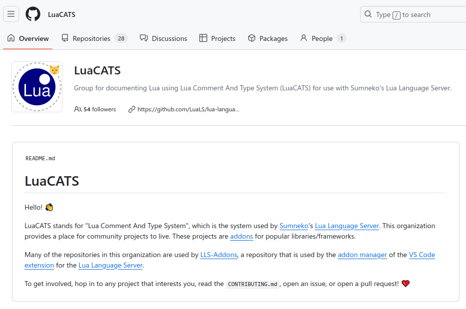

# LuaTeX Lua API

Type definitions for the Lua API of `LuaTeX` and related projects.


[LuaTeX](http://luatex.org) has a very large [Lua](https://www.lua.org)
API. This project tries to make this API accessible in the text editor
of your choice. This is made possible by the
[lua-language-server](https://github.com/LuaLS/lua-language-server) - a
server that implements the [Language Server Protocol
(LSP)](https://en.wikipedia.org/wiki/Language_Server_Protocol) for the
`Lua` language. Features such as code completion, syntax highlighting
and marking of warnings and errors, should therefore not only be
possible in [Visual Studio Code](https://code.visualstudio.com), but in
a [large number of
editors](https://langserver.org/#implementations-client) that support
the `LSP`.

## Subprojects

* [lualatex](https://github.com/Josef-Friedrich/LuaTeX_Lua-API/tree/main/library/lualatex)
* [lualibs](https://github.com/Josef-Friedrich/LuaTeX_Lua-API/tree/main/library/lualibs)
* [luametatex](https://github.com/Josef-Friedrich/LuaTeX_Lua-API/tree/main/library/luametatex)
* [luaotfload](https://github.com/Josef-Friedrich/LuaTeX_Lua-API/tree/main/library/luaotfload)
* [luatex](https://github.com/Josef-Friedrich/LuaTeX_Lua-API/tree/main/library/luatex)

## Distribution ...

## via CTAN


The type definitions are published on
[CTAN](https://www.ctan.org/pkg/luatex-type-definitions) as a single
file to avoid cluttering the CTAN directory with many individual Lua
files. Since this one file is just under 1.5 MB in size, a configuration
must be made so that the language server can load the file. The
following configuration example sets the preload file size to a maximum
of 5000 kB.

```json
{
    "Lua.workspace.preloadFileSize": 5000,
}
```

There are several ways to include type definitions in a project.
The easiest way is to copy the file into the project folder.
Or you can use the configuration `Lua.workspace.library`:

```json
{
    "Lua.workspace.library": ["/path/to/luatex-type-definitions.lua"]
}
```

### via Visual Studio Code Extension


* [Visual Studio Code LuaTeX Extension](https://github.com/Josef-Friedrich/vscode_LuaTeX_Lua-API)
  ← [library](https://github.com/Josef-Friedrich/LuaTeX_Lua-API/tree/main/library)

### via LuaCATS git respositories



[LuaCATS](https://github.com/LuaCATS) is a [Github](https://github.com)
organisation and stands for *“Lua Comment And Type System”*. This
organization provides a place for community projects to live. These
projects are [addons](https://luals.github.io/wiki/addons) for popular
libraries/frameworks.
The repositories in this organization are used by
[LLS-Addons](https://github.com/LuaLS/LLS-Addons), a repository that is used by the [addon
manager](https://luals.github.io/wiki/addons/#addon-manager) of the [VS
Code
extension](https://marketplace.visualstudio.com/items?itemName=sumneko.lua)
for the [Lua Language Server]([lls](https://github.com/LuaLS/lua-language-server)).

#### All related LuaCATS repositories

This repositories in LuaCATS are related to this project:

* [lmathx](https://github.com/LuaCATS/lmathx)
* [lpeg](https://github.com/LuaCATS/lpeg)
* [luafilesystem](https://github.com/LuaCATS/luafilesystem)
* [luaharfbuzz](https://github.com/LuaCATS/luaharfbuzz)
* [luasocket](https://github.com/LuaCATS/luasocket)
* [luazip](https://github.com/LuaCATS/luazip)
* [lzlib](https://github.com/LuaCATS/lzlib)
* [md5](https://github.com/LuaCATS/md5)
* [slnunicode](https://github.com/LuaCATS/slnunicode)
* [tex-lualatex](https://github.com/LuaCATS/tex-lualatex)
* [tex-lualibs](https://github.com/LuaCATS/tex-lualibs)
* [tex-luametatex](https://github.com/LuaCATS/tex-luametatex)
* [tex-luatex](https://github.com/LuaCATS/tex-luatex)

#### Upstream LuaCATS repositories

The following repositories are *upstream* projects. This means: The type
definitions are developed in a LuaCATS repository and *pulled* in by
this project.

* [LuaCATS: lmathx](https://github.com/LuaCATS/lmathx)
  → [library/luametatex/lmathx.lua](https://github.com/Josef-Friedrich/LuaTeX_Lua-API/blob/main/library/luametatex/xmath.lua)
* [LuaCATS: lpeg](https://github.com/LuaCATS/lpeg)
  → [library/luatex/lpeg.lua](https://github.com/Josef-Friedrich/LuaTeX_Lua-API/blob/main/library/luatex/lpeg.lua)
* [LuaCATS: luaharfbuzz](https://github.com/LuaCATS/luaharfbuzz)
  → [library/luatex/luaharfbuzz.lua](https://github.com/Josef-Friedrich/LuaTeX_Lua-API/blob/main/library/luatex/luaharfbuzz.lua)
* [LuaCATS: luasocket](https://github.com/LuaCATS/luasocket)
  → [library/luatex/socket.lua](https://github.com/Josef-Friedrich/LuaTeX_Lua-API/blob/main/library/luatex/socket.lua)
  → [library/luatex/mime.lua](https://github.com/Josef-Friedrich/LuaTeX_Lua-API/blob/main/library/luatex/mime.lua)
* [LuaCATS: luazip](https://github.com/LuaCATS/luazip)
  → [library/luatex/zip.lua](https://github.com/Josef-Friedrich/LuaTeX_Lua-API/blob/main/library/luatex/zip.lua)
* [LuaCATS: lzlib](https://github.com/LuaCATS/lzlib)
  → [library/luatex/zlib.lua](https://github.com/Josef-Friedrich/LuaTeX_Lua-API/blob/main/library/luatex/zlib.lua)
* [LuaCATS: md5](https://github.com/LuaCATS/md5)
  → [library/luatex/md5.lua](https://github.com/Josef-Friedrich/LuaTeX_Lua-API/blob/main/library/luatex/md5.lua)
* [LuaCATS: slnunicode](https://github.com/LuaCATS/slnunicode)
  → [library/luatex/unicode.lua](https://github.com/Josef-Friedrich/LuaTeX_Lua-API/blob/main/library/luatex/unicode.lua)

#### Downstream LuaCATS repositories

The following repositories are *downstream* projects. This means: The
type definitions are developed in this project. They are then *pushed*
into a LuaCATS repository.

* [LuaCATS: tex-lualatex](https://github.com/LuaCATS/tex-lualatex)
  ← [library/lualatex](https://github.com/Josef-Friedrich/LuaTeX_Lua-API/tree/main/library/lualatex)
* [LuaCATS: tex-luatex](https://github.com/LuaCATS/tex-luatex)
  ← [library/luatex](https://github.com/Josef-Friedrich/LuaTeX_Lua-API/tree/main/library/luatex)
* [LuaCATS: tex-lualibs](https://github.com/LuaCATS/tex-lualibs)
  ← [library/lualibs](https://github.com/Josef-Friedrich/LuaTeX_Lua-API/tree/main/library/lualibs)
* [LuaCATS: tex-luametatex](https://github.com/LuaCATS/tex-luametatex)
  ← [library/luametatex](https://github.com/Josef-Friedrich/LuaTeX_Lua-API/tree/main/library/luametatex)

## Directory structure of the repository

In the subfolder `library` are files named after the global libraries
they document. For example, the `library/tex.lua` file contains the
documentation for the `tex` library. These *Lua* files don’t contain
real *Lua* code. They consist only of function bodies and empty
tables. The main focus is in the docstrings.

The API documentation is written in a [well documented annotation
format](https://luals.github.io/wiki/annotations).
This format is based on the [EmmyLua](https://emmylua.github.io)
format. Unfortunately, the *Lua* community has not yet been able to
agree on a standarized annotation format. Many *Lua* project are
documented in the [LDoc](https://github.com/lunarmodules/LDoc) format.
However, the differences between these formats are marginal.

### Directory `library`

The actual definitions are located in the directory `library`. This
directory is divided into further subdirectories. In the folder `luatex`
you will find the definitions that the engine *LuaTeX* provides. The
folder `lualibs` documents the extension library of the same name. If
you use `lualatex`, you may be interested in the folder of the same
name.

### Directory `resources`

The folder `resources` contains *TeX* manuals and *HTML* online
documentation  converted into *Lua* docstrings.

### Directory `examples`

The `example` folder contains *TeX* and *Lua* files for demonstrating
and testing the documented Lua API.

## Current version

2025/07/24 v0.2.0

## License

Copyright (C) 2022-2025 by Josef Friedrich <josef@friedrich.rocks>
------------------------------------------------------------------------

This program is free software: you can redistribute it and/or modify it
under the terms of the GNU General Public License as published by the
Free Software Foundation, either version 2 of the License, or (at your
option) any later version.

This program is distributed in the hope that it will be useful, but
WITHOUT ANY WARRANTY; without even the implied warranty of
MERCHANTABILITY or FITNESS FOR A PARTICULAR PURPOSE. See the GNU General
Public License for more details.

You should have received a copy of the GNU General Public License along
with this program. If not, see <https://www.gnu.org/licenses/>.

### About the license selection

The same license was used for the type definitions as for LuaTeX (GPLv2).
The MIT license is used for the external upstream projects.

### GPLv2 copyright notice for every file

Only two hyphens are used here, rather than three, so that the copyright notice
does not end up in the rendered documentation.

```lua
-- -----------------------------------------------------------------------------
-- Copyright (C) 2022-2025 by Josef Friedrich <josef@friedrich.rocks>
-- -----------------------------------------------------------------------------
--
-- This program is free software: you can redistribute it and/or modify it
-- under the terms of the GNU General Public License as published by the
-- Free Software Foundation, either version 2 of the License, or (at your
-- option) any later version.
--
-- This program is distributed in the hope that it will be useful, but
-- WITHOUT ANY WARRANTY; without even the implied warranty of
-- MERCHANTABILITY or FITNESS FOR A PARTICULAR PURPOSE. See the GNU General
-- Public License for more details.
--
-- You should have received a copy of the GNU General Public License along
-- with this program. If not, see <https://www.gnu.org/licenses/>.
--
-- -----------------------------------------------------------------------------

```

### MIT copyright notice for every file

```lua
-- -----------------------------------------------------------------------------
-- Copyright (c) 2023-2025 by Josef Friedrich <josef@friedrich.rocks>
-- -----------------------------------------------------------------------------
--
-- MIT License
--
-- Permission is hereby granted, free of charge, to any person obtaining a copy
-- of this software and associated documentation files (the "Software"), to deal
-- in the Software without restriction, including without limitation the rights
-- to use, copy, modify, merge, publish, distribute, sublicense, and/or sell
-- copies of the Software, and to permit persons to whom the Software is
-- furnished to do so, subject to the following conditions:
--
-- The above copyright notice and this permission notice shall be included in
-- all copies or substantial portions of the Software.
--
-- THE SOFTWARE IS PROVIDED "AS IS", WITHOUT WARRANTY OF ANY KIND, EXPRESS OR
-- IMPLIED, INCLUDING BUT NOT LIMITED TO THE WARRANTIES OF MERCHANTABILITY,
-- FITNESS FOR A PARTICULAR PURPOSE AND NONINFRINGEMENT. IN NO EVENT SHALL THE
-- AUTHORS OR COPYRIGHT HOLDERS BE LIABLE FOR ANY CLAIM, DAMAGES OR OTHER
-- LIABILITY, WHETHER IN AN ACTION OF CONTRACT, TORT OR OTHERWISE, ARISING FROM,
-- OUT OF OR IN CONNECTION WITH THE SOFTWARE OR THE USE OR OTHER DEALINGS IN THE
-- SOFTWARE.
--
-- -----------------------------------------------------------------------------

```

## Installation / Setup for Visual Studio Code

Install [Visual Studio Code](https://code.visualstudio.com/) and the
[lua-language-server](https://marketplace.visualstudio.com/items?itemName=sumneko.lua).


```
git clone https://github.com/Josef-Friedrich/LuaTeX_Lua-API.git
```

`.vscode/settings.json`:

```json
{
"Lua.workspace.library": [
    "<repo>/library"
  ]
}
```

## How to contribute

The preferred method of contributing to the project is via Github pull
requests. You can also email patches to josef@friedrich.rocks.
It is ok if you only document the data types of the input parameters.

Use imperative mood for the first line: https://peps.python.org/pep-0257/

`Please contribute!` messages

Default message:

```lua
---😱 [Types](https://github.com/Josef-Friedrich/LuaTeX_Lua-API/blob/main/library/luatex/pdf.lua) incomplete or incorrect? 🙏 [Please contribute!](https://github.com/Josef-Friedrich/LuaTeX_Lua-API/pulls)
```

No documentation at all:

```lua
---
---Warning! Undocumented code!<p>
---TODO: Please contribute
---https://github.com/Josef-Friedrich/LuaTeX_Lua-API#how-to-contribute
```

### Minimal example of `tex.sp()`

```lua
---
---@param s string
function tex.sp(s) end
```

### Less minimal example of `tex.sp()`

```lua
---
---@param s string
---
---@return integer
function tex.sp(s) end
```

Or if you have more time you can also expand the documentation to this
level:

### Prime example of `tex.sp()`

```lua
---@meta

tex = {}

---
---Convert a string `s` that represents an explicit
---dimension into an integer number of scaled points.
---
---For parsing the string, the same scanning and conversion rules are used that
---*LuaTeX* would use if it was scanning a dimension specifier in its *TeX*-like
---input language (this includes generating errors for bad values), expect for the
---following:
---
---* only explicit values are allowed, control sequences are not handled
---* infinite dimension units (`fil...`) are forbidden
---* `mu` units do not generate an error (but may not be useful either)
---
---__Example:__
---
---```lua
---local scaled_points = tex.sp('1cm')
---print(scaled_points) -- 1864679
---```
---
---__Reference:__
---
---* `LuaTeX` manual: 10.3.15.5 `sp` page 204
---* Source file of the `LuaTeX` manual: [luatex-tex.tex#L1386-L1413](https://gitlab.lisn.upsaclay.fr/texlive/luatex/-/blob/f52b099f3e01d53dc03b315e1909245c3d5418d3/manual/luatex-tex.tex#L1386-L1413)
---
---@param s string # A string to convert into scaled points.
---
---@return integer # The dimension in the scaled points format.
function tex.sp(s) end
```

The docstring above is rendered as follows in Visual Studio Code:


This quick hacked and very ugly Python script
[resources/manuals/convert-tex-to-lua-docstrings.py](https://github.com/Josef-Friedrich/LuaTeX_Lua-API/blob/main/resources/manuals/convert-tex-to-lua-docstrings.py)
was used to convert the source files.

### Navigation table `_N`

Some Lua files contain a table named `_N`. `_N` stands for *navigation*.
With the help of this table and the outline view of the editor, it is
easier to navigate through the documentation. The name is inspired by
the global Lua table `_G`. Many parts of the documentation, such as the
definition of the various `Node` classes, are not shown in the outline.
In the released version, this navigation table is removed using the
`manage.py` management script.

```lua
-- The `_N` table makes it easier to navigate through the type definitions with
-- the help of the outline:
-- https://github.com/TeXLuaCATS/meta?tab=readme-ov-file#navigation-table-_n
_N = {}
```

The different node types are defined as classes. Since this class
definition takes place entirely in the comments, it is not displayed in
the outline.

```lua
_N.hlist = 0

---@class HlistNode: ListNode

_N.vlist = 1

---@class VlistNode: ListNode
```

The following example refers to section “8.7.2 is_node” on page 149 in
the LuaTeX documentation.

```lua
_N._8_7_2_is_node = "page 149"
```

### Documentation of function overloading

`LuaTeX` makes extensive use of function overloading. The following
example is taken from the `LuaTeX` manual:

```
<number> w, <number> h, <number> d =
  node.dimensions(<node> n)
<number> w, <number> h, <number> d =
  node.dimensions(<node> n, <string> dir)
<number> w, <number> h, <number> d =
  node.dimensions(<node> n, <node> t)
<number> w, <number> h, <number> d =
  node.dimensions(<node> n, <node> t, <string> dir)
<number> w, <number> h, <number> d =
  node.dimensions(<number> glue_set, <number> glue_sign, <number> glue_order, <node> n)
<number> w, <number> h, <number> d =
  node.dimensions(<number> glue_set, <number> glue_sign, <number> glue_order, <node> n, <string> dir)
<number> w, <number> h, <number> d =
  node.dimensions(<number> glue_set, <number> glue_sign, <number> glue_order, <node> n, <node> t)
<number> w, <number> h, <number> d =
  node.dimensions(<number> glue_set, <number> glue_sign, <number> glue_order, <node> n, <node> t, <string> dir)
```

This can easily be done by documenting the function with the same name
but different signatures multiple times.

[Issue for further improvement of the function loading](https://github.com/sumneko/lua-language-server/issues/1456)

Function overloading in `tex.sp()`


### Overview of the existing Lua language server

#### lua-language-server

The most popular language server, simply named
[lua-language-server](https://github.com/LuaLS/lua-language-server), was
created by a Chinese with the nickname
[*sumneko*](https://github.com/sumneko). In addition to the nickname,
*sumnekos* Github profile also shows 最萌小汐 in Chinese characters,
which means “The cutest Xiaoxi”[^google-translate] or “Xiao Shi, the
most adorable child in the world”[^deepl]. The [first
commit](https://github.com/LuaLS/lua-language-server/commit/3546129c29fbfd7211099a3fbee03a763915ab58)
in the Git repository was made on 7 September 2018. The
*lua-language-server* is written in Lua. In August 2025, the repository
on Gibhub has around 3,800 stars.

[^google-translate]: https://translate.google.de/?sl=zh-CN&tl=en&text=%E6%9C%80%E8%90%8C%E5%B0%8F%E6%B1%90%20&op=translate
[^deepl]: https://www.deepl.com/en/translator#zh/en-gb/%E6%9C%80%E8%90%8C%E5%B0%8F%E6%B1%90

### EmmyLua Analyzer Rust

A promising language server that is not written in Lua but in Rust is
the [EmmyLua Analyzer
Rust](https://github.com/EmmyLuaLs/emmylua-analyzer-rust). This server
was written by [CppCXY](https://github.com/CppCXY), the developer with
the most commits after sumneko. The new server is advertised in
[several](https://github.com/LuaLS/lua-language-server/issues/2910)
[issues](https://github.com/LuaLS/lua-language-server/issues/3017) in
the sumnekos *lua-language-server* Github repository.

### Documentation of nodes

A node (object) can be described by the `@class` annotation and provided
with some documentation about its attributes using `@field`. There is a base class `Node` for all node type classes.

```lua
---
---A node that comprise actual typesetting commands. A few fields are
---present in all nodes regardless of their type, these are:
---
---@class Node
---@field next Node|nil # the next node in a list, or nil
---@field prev Node|nil # That prev field is always present, but only initialized on explicit request ...
```

The `KernNode` class for example inherits from `Node` and represents
a kern node.

```lua
---
---The `kern` command creates such nodes but for instance the font and math
---machinery can also add them.
---
---@class KernNode: Node
---@field subtype KernNodeSubtype
---@field kern integer # Fixed horizontal or vertical advance (in scaled points)
```

```lua
---@alias KernNodeSubtype
---|0 # fontkern
---|1 # userkern
---|2 # accentkern
---|3 # italiccorrection
```

The `@cast` annotation forces a unspecific node to a distinct node type.

```lua
while n do
  if n.id == node.id('kern') then
    ---@cast n KernNode
    print(n.kern)
  end
  n = n.next
end
```

Use `--[[@as <node type>]]` to force a node type onto an expression.

```lua
local kern = node.new('kern') --[[@as KernNode]]
```


### Documentation of callback functions

How a callback function is documented is shown using the
`pre_linebreak_filter` as an example.

#### @alias `PreLinebreakFilterGroupCode`

```lua
---
---The string called `groupcode` identifies the nodelist's context within
---*TeX*'s processing. The range of possibilities is given in the table below, but
---not all of those can actually appear in `pre_linebreak_filter`, some are
---for the `hpack_filter` and `vpack_filter` callbacks that will be
---explained in the next two paragraphs.
---@alias PreLinebreakFilterGroupCode
---|'' # main vertical list
---|'hbox' # hbox` in horizontal mode
---|'adjusted_hbox' #hbox` in vertical mode
---|'vbox' # vbox`
---|'vtop' # vtop' #
---|'align' # halign` or `valign`
---|'disc' # discretionaries
---|'insert' # packaging an insert
---|'vcenter' # vcenter`
---|'local_box' # localleftbox` or `localrightbox`
---|'split_off' # top of a `vsplit`
---|'split_keep' # remainder of a `vsplit`
---|'align_set' # alignment cell
---|'fin_row' # alignment row
```

#### @alias `NodeCallbackReturn`


```lua
---
---As for all the callbacks that deal with nodes, the return value can be one of
---three things:
---
---* boolean `true` signals successful processing
---* `<node>` signals that the “head” node should be replaced by the
---  returned node
---* boolean `false` signals that the “head” node list should be
---  ignored and flushed from memory
---@alias NodeCallbackReturn true|false|Node
```

#### @alias `PreLinebreakFilter`

```lua
---
---# `pre_linebreak_filter` callback
---
---This callback is called just before *LuaTeX* starts converting a list of nodes
---into a stack of `hbox`es, after the addition of `parfillskip`.
---
---```lua
------@type PreLinebreakFilter
---function(head, groupcode)
---  --- true|false|node
---  return true
---end
---```
---
---This callback does not replace any internal code.
---@alias PreLinebreakFilter fun(head: Node, groupcode: PreLinebreakFilterGroupCode): NodeCallbackReturn
```

Annotation your custom callback function with `@type`.

```lua
---@type PreLinebreakFilter
local function visit_nodes(head, group)
  return true
end

luatexbase.add_to_callback('pre_linebreak_filter', visit_nodes, 'visit nodes')
```


Quick info `node.id(type)`


Type error in `node.id(type)`


`node.id(type)` type definition


Quick info `node.write(n)`


Documentation for the field `data` of the `pdf_colorstack` node:


## Documentation

* [LuaTeX Repo](https://gitlab.lisn.upsaclay.fr/texlive/luatex/) [LuaTeX Mirror](https://github.com/TeX-Live/luatex)
* [pdfTeX Mirror](https://github.com/tex-mirror/pdftex)

## Howtos

* [Custom libraries](https://github.com/sumneko/lua-language-server/wiki/Libraries#custom)
* [@meta annotation](https://github.com/sumneko/lua-language-server/wiki/Annotations#meta)

## Other type definition / stub repos:

* [Template of the Lua interface itself](https://github.com/sumneko/lua-language-server/tree/master/meta/template)
* [In the lua-language-server included 3rd party libraries](https://github.com/sumneko/lua-language-server/tree/master/meta/3rd)
* [FiveM Lua Stubs](https://github.com/jamie-34254/fivem_lua_stubs)

## Annotation

### @meta

Do not put the `@meta` tag in the docstrings for a global table, because
EmmaLua Rust will not render the docstrings for this global table.

Marks a file as "meta", meaning it is used for definitions and not for
its functional Lua code. It is used internally by the language server
for defining the [built-in Lua
libraries](https://github.com/LuaLS/lua-language-server/tree/master/meta/template).
If you are writing your own [definition files](/wiki/definition-files),
you will probably want to include this annotation in them. If you
specify a name, it will only be able to be required by the given name.
Giving the name `_` will make it unable to be required. Files with the
`@meta` tag in them behave a little different:

- Completion will not display context in a meta file
- Hovering a `require` of a meta file will show `[meta]` instead of its absolute path
- `Find Reference` ignores meta files

**Syntax**

`---@meta [name]`

**Examples**


Mark Meta File

```Lua
---@meta [name]
```
[^luals-meta]

[^luals-meta]: https://github.com/LuaLS/LuaLS.github.io/blob/f87938ff71a9322ac2bdcbac2164ad2da7e394f0/src/content/wiki/annotations.mdx?plain=1#L731-L752

## HTML doc generator

The [EmmyLua Analyzer
Rust](https://github.com/EmmyLuaLs/emmylua-analyzer-rust) provides a
[documentation generation tool](https://github.com/EmmyLuaLs/emmylua-analyzer-rust/tree/main/crates/emmylua_doc_cli).
This tool generates Markdown files which can be parsed by [mkdocs](https://www.mkdocs.org).

```yml
site_name: LuaTeX Lua API type definitions

theme:
  name: material
  font:
    text: Roboto
    code: Roboto Mono
  search: true
  features:
    - quick-links
    - navigation
    - search
    - toc
    - fullscreen
    - bookmarks
    - tabs
    - code
    - edit-on-github
    - language-selector
    - code
    - cover
    - footer
    - social-share
    - theme-switcher

markdown_extensions:
  - pymdownx.highlight:
      anchor_linenums: true
      line_spans: __span
      pygments_lang_class: true
  - pymdownx.inlinehilite
  - pymdownx.snippets
  - pymdownx.superfences
```

## References


```lua
---
---__Reference:__
---
---* Source file of the `LuaTeX` manual: []()
---
```

## Global namespaces

The Makefile provides targets for printing the global namespace
available on the specific engines. The Makefile uses some Lua functions
to output all functions and tables of the global namespace that can be
found in
[utils.lua](https://github.com/Josef-Friedrich/LuaTeX_Lua-API/blob/main/resources/utils.lua).

To print the [LuaTeX global
namespace](https://github.com/Josef-Friedrich/LuaTeX_Lua-API/blob/main/resources/namespaces/luatex.md):

```
make namespace_luatex
```

To print the [LuaMetaTeX global namespace](https://github.com/Josef-Friedrich/LuaTeX_Lua-API/blob/main/resources/namespaces/luametatex_luaonly.md):

```
make namespace_luametatex
```
